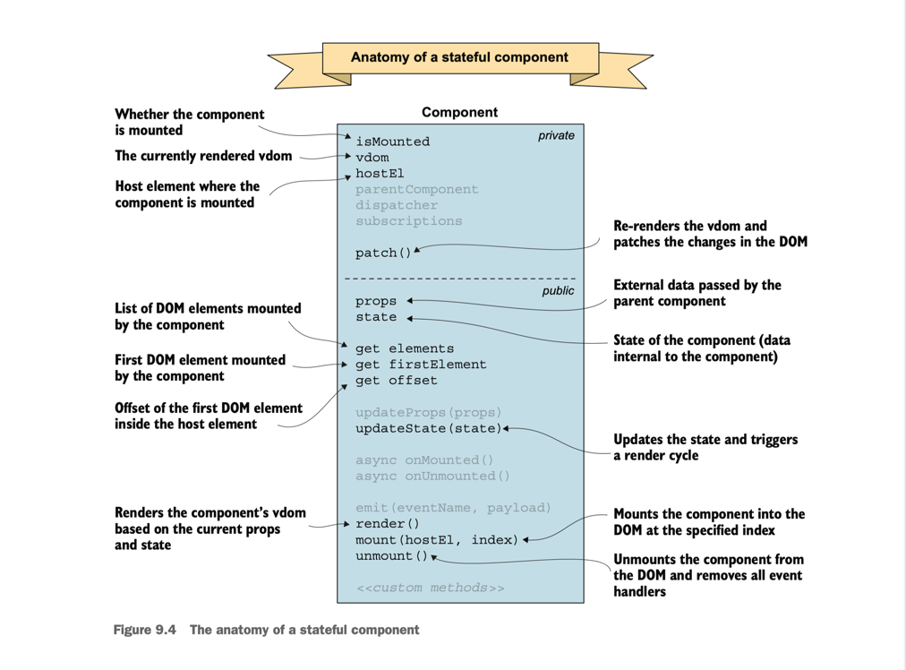

# The component.js Explanation

The `component.js` module is the core of our web framework’s component system, enabling stateful components that maintain internal state and update their views dynamically. Unlike pure functions with fixed outputs, stateful components track data, like the number of tasks completed today, and re-render when it changes. In your TODOs app, a `DailyCompleteTodoCounter` component might display “Tasks completed today: 2,” updating when a task is marked complete.

This module defines a `Component` class and a `defineComponent()` factory function to create custom components. Each instance manages its own state and DOM subtree, integrating with your app’s MVC architecture (Model, View, Controller). Key features include:
- Views driven by `props` (parent data) and `state` (internal data), updating on changes.
- Support for varied virtual DOMs, like `TodoItem` or `DailyCompleteTodoCounter`.
- Efficient mounting, unmounting, and patching using DOM utilities (`mountDOM`, `patchDOM`).

This documentation details each method’s logic and provides examples using `DailyCompleteTodoCounter` and `TodoItem`, integrated with your TODOs app.

# Anatomy of a Stateful Component



A stateful component maintains its own state, enabling unique data per instance. When state changes, the view re-renders. For example, `DailyCompleteTodoCounter` starts with `state = { dailyCount: 0 }` and updates to `{ dailyCount: 1 }` when a task is completed today, refreshing the display.

## Properties of a Stateful Component

Public properties manage data and DOM:
- **`props`**: Parent-provided data, like `{ id: 1, text: 'Buy milk' }` for `TodoItem`. Updated via `updateProps()`.
- **`state`**: Internal data, like `{ dailyCount: 0 }` for `DailyCompleteTodoCounter`. Updated via `updateState()`.
- **`elements`**: List of mounted DOM elements (e.g., multiple for fragments, one for single roots).
- **`firstElement`**: First element in `elements`, used for DOM positioning.
- **`offset`**: Index of `firstElement` in the parent’s DOM for fragments, correcting node operations.

Private properties include:
- **`#isMounted`**: Tracks mounting status.
- **`#vdom`**: Current virtual DOM for rendering/patching.
- **`#hostEl`**: DOM element hosting the component.
- **`#eventHandlers`**, **`#subscriptions`**, **`#dispatcher`**: Event handling.
- **`#children`**: External child content for slots.
- **`#appContext`**: Shared app context.

## Methods of a Stateful Component

Each method is explained with its logic (purpose, workings, interactions) and an example using `DailyCompleteTodoCounter` and `TodoItem`, integrated with your TODOs app.

### defineComponent()

**Logic**:  
The `defineComponent()` factory creates a custom `Component` class from a configuration object (`render`, `state`, `onMounted`, `onUnmounted`, custom methods). It:
- Defines a `Component` class with core methods.
- Binds `render` to the instance using `call(this)` to ensure `this` accesses `state` and `props`.
- Adds custom methods to the prototype, checking for conflicts with `hasOwnProperty`.
- Returns the class for instantiation, enabling multiple instances with shared behavior but separate state.

This allows creating `DailyCompleteTodoCounter` to track daily completions or `TodoItem` for task rendering, each tailored to your app’s needs.

**Code**:
```javascript
export function defineComponent({ render, state, onMounted = emptyFn, onUnmounted = emptyFn, ...methods }) {
    class Component {
        // ... other methods ...
        render() {
            const vdom = render.call(this);
            if (didCreateSlot()) {
                fillSlots(vdom, this.#children);
                resetDidCreateSlot();
            }
            return vdom;
        }
    }
    for (const methodName in methods) {
        if (hasOwnProperty(Component, methodName)) {
            throw new Error(`Method "${methodName}()" already exists in the component.`);
        }
        Component.prototype[methodName] = methods[methodName];
    }
    return Component;
}
```

**Example Implementation**:
```javascript
// DailyCompleteTodoCounter component
const DailyCompleteTodoCounter = defineComponent({
  state() {
    return { dailyCount: 0 };
  },
  render() {
    return h('p', [
      `Tasks completed today: ${this.state.dailyCount}`,
    ]);
  },
  onMounted() {
    console.log('Daily counter mounted');
  },
  incrementCount() {
    this.updateState({ dailyCount: this.state.dailyCount + 1 });
  },
  resetCount() {
    this.updateState({ dailyCount: 0 });
  },
});

// TodoItem component
const TodoItem = defineComponent({
  state() {
    return { completed: false };
  },
  render() {
    return h('li', [
      h('input', {
        type: 'checkbox',
        checked: this.state.completed,
        on: {
          change: () => {
            this.updateState({ completed: !this.state.completed });
            this.emit('toggle', { id: this.props.id, completed: this.state.completed });
          },
        },
      }),
      h('span', {}, [this.props.text]),
      hSlot(),
    ]);
  },
  toggleTodo() {
    this.updateState({ completed: !this.state.completed });
  },
});
```

### constructor()

**Logic**:  
The `constructor()` initializes a component with:
- `props`: Parent data, defaulting to `{}`.
- `state`: Set by calling `state()` with `props`, or `{}` if absent, allowing state to depend on props.
- `eventHandlers`: Callbacks for parent communication.
- `parentComponent`: Reference for event context.

It prepares the component for rendering/mounting. For `DailyCompleteTodoCounter`, `props` might be empty, but `state` initializes `{ dailyCount: 0 }`.

**Code**:
```javascript
constructor(props = {}, eventHandlers = {}, parentComponent = null) {
  this.props = props;
  this.state = state ? state(props) : {};
  this.#eventHandlers = eventHandlers;
  this.#parentComponent = parentComponent;
}
```

**Example Implementation**:
```javascript
// DailyCompleteTodoCounter
const dailyCounter = new DailyCompleteTodoCounter(); // state: { dailyCount: 0 }

// TodoItem
const todo = new TodoItem({ id: 1, text: 'Buy milk' }); // state: { completed: false }, props: { id: 1, text: 'Buy milk' }
```

### render()

**Logic**:  
The `render()` method generates the virtual DOM using `props` and `state`. It:
- Calls the user-defined `render` with `call(this)` for proper `this` binding.
- Handles slots via `didCreateSlot()`, filling them with `#children` using `fillSlots()` and resetting with `resetDidCreateSlot()`.
- Returns the virtual DOM (fragment, element, or component).

For `DailyCompleteTodoCounter`, it renders a `<p>` with the daily count; for `TodoItem`, a `<li>` with a checkbox and text.

**Code**:
```javascript
render() {
  const vdom = render.call(this);
  if (didCreateSlot()) {
    fillSlots(vdom, this.#children);
    resetDidCreateSlot();
  }
  return vdom;
}
```

**Example Implementation**:
```javascript
// DailyCompleteTodoCounter
const DailyCompleteTodoCounter = defineComponent({
  state() { return { dailyCount: 0 }; },
  render() {
    return h('p', [
      `Tasks completed today: ${this.state.dailyCount}`,
    ]);
  },
});

// TodoItem with slot
const TodoItem = defineComponent({
  state() { return { completed: false }; },
  render() {
    return h('li', {}, [
      h('input', { type: 'checkbox', checked: this.state.completed, on: { change: () => {
        this.updateState({ completed: !this.state.completed });
        this.emit('toggle', { id: this.props.id, completed: this.state.completed });
      } } }),
      h('span', {}, [this.props.text]),
      hSlot(),
    ]);
  },
});
const todo = new TodoItem({ text: 'Buy milk' });
todo.setExternalContent([h('span', {}, [' (urgent)'])]); // Fills slot
```

### mount()

**Logic**:  
The `mount()` method attaches the component to the DOM at `hostEl` (optionally at `index`). It:
- Checks `#isMounted` to prevent double-mounting.
- Renders the virtual DOM with `render()`.
- Uses `mountDOM()` to insert the DOM, passing `this` for offset calculations.
- Sets up event handlers with `#wireEventHandlers()`.
- Updates `#isMounted` and `#hostEl`.

In your app, `DailyCompleteTodoCounter` mounts above the `.todo-list` in the `<header>`.

**Code**:
```javascript
mount(hostEl, index = null) {
  if (this.#isMounted) {
    throw new Error('Component is already mounted');
  }
  this.#vdom = this.render();
  mountDOM(this.#vdom, hostEl, index, this);
  this.#wireEventHandlers();
  this.#isMounted = true;
  this.#hostEl = hostEl;
}
```

**Example Implementation**:
```javascript
// DailyCompleteTodoCounter
const dailyCounter = new DailyCompleteTodoCounter();
dailyCounter.mount(document.querySelector('header')); // Adds <p>Tasks completed today: 0</p>

// TodoItem
const todo = new TodoItem({ id: 1, text: 'Buy milk' });
todo.mount(document.querySelector('.todo-list'), 0); // Adds <li> at index 0
```

### unmount()

**Logic**:  
The `unmount()` method removes the component from the DOM, cleaning up:
- Verifies mounting status.
- Destroys the virtual DOM with `destroyDOM()`.
- Unsubscribes event handlers via `#subscriptions`.
- Resets `#vdom`, `#isMounted`, `#hostEl`, `#subscriptions`.

For `DailyCompleteTodoCounter`, this removes the counter `<p>` and its listeners.

**Code**:
```javascript
unmount() {
  if (!this.#isMounted) {
    throw new Error('Component is not mounted');
  }
  destroyDOM(this.#vdom);
  this.#subscriptions.forEach((unsubscribe) => unsubscribe());
  this.#vdom = null;
  this.#isMounted = false;
  this.#hostEl = null;
  this.#subscriptions = [];
}
```

**Example Implementation**:
```javascript
// DailyCompleteTodoCounter
dailyCounter.unmount(); // Removes <p>, clears subscriptions

// TodoItem
todo.unmount(); // Removes <li>, clears checkbox listeners
```

### updateState()

**Logic**:  
The `updateState()` method updates `state` by:
- Merging new state with current state using spread operator.
- Calling `#patch()` to re-render.

For `DailyCompleteTodoCounter`, it increments `dailyCount` when a task is completed today.

**Code**:
```javascript
updateState(state) {
  this.state = { ...this.state, ...state };
  this.#patch();
}
```

**Example Implementation**:
```javascript
// DailyCompleteTodoCounter
const dailyCounter = new DailyCompleteTodoCounter();
dailyCounter.updateState({ dailyCount: 1 }); // Updates to Tasks completed today: 1

// TodoItem
const todo = new TodoItem({ id: 1, text: 'Buy milk' });
todo.updateState({ completed: true }); // Marks as completed
```

### updateProps()

**Logic**:  
The `updateProps()` method updates `props` by:
- Merging new props with existing ones.
- Calling `#patch()` to re-render.

In `TodoItem`, this updates the displayed text if the parent changes it.

**Code**:
```javascript
updateProps(props) {
  this.props = { ...this.props, ...props };
  this.#patch();
}
```

**Example Implementation**:
```javascript
// TodoItem
const todo = new TodoItem({ id: 1, text: 'Buy milk' });
todo.updateProps({ text: 'Buy bread' }); // Updates displayed text
```

### #patch()

**Logic**:  
The private `#patch()` method updates the DOM by:
- Ensuring the component is mounted.
- Rendering a new virtual DOM.
- Reconciling with `patchDOM()`, passing `this` for offset.
- Updating `#vdom`.

For `DailyCompleteTodoCounter`, it refreshes the count display.

**Code**:
```javascript
#patch() {
  if (!this.#isMounted) {
    throw new Error('Component is not mounted');
  }
  const vdom = this.render();
  this.#vdom = patchDOM(this.#veverywhere(this.#vdom, vdom, this.#hostEl, this);
}
```

**Example Implementation**:
```javascript
// DailyCompleteTodoCounter
dailyCounter.updateState({ dailyCount: 2 }); // Updates DOM to Tasks completed today: 2

// TodoItem
todo.updateState({ completed: true }); // Updates checkbox
```

### get elements()

**Logic**:  
The `elements` getter returns mounted DOM elements:
- Empty array if `#vdom` is null.
- For fragments, collects all child elements with `extractChildren()` and `flatMap()`.
- For single roots, returns `[#vdom.el]`.

For `TodoItem`, it lists `<input>` and `<span>`.

**Code**:
```javascript
get elements() {
  if (this.#vdom == null) {
    return [];
  }
  if (this.#vdom.type === DOM_TYPES.FRAGMENT) {
    return extractChildren(this.#vdom).flatMap((child) => {
      if (child.type === DOM_TYPES.COMPONENT) {
        return child.component.elements;
      }
      return [child.el];
    });
  }
  return [this.#vdom.el];
}
```

**Example Implementation**:
```javascript
// TodoItem
const todo = new TodoItem({ id: 1, text: 'Buy milk' });
todo.mount(document.body);
console.log(todo.elements); // [<input>, <span>]
```

### get firstElement()

**Logic**:  
The `firstElement` getter returns the first element from `elements`, critical for `offset` calculations.

**Code**:
```javascript
get firstElement() {
  return this.elements[0];
}
```

**Example Implementation**:
```javascript
// DailyCompleteTodoCounter
console.log(dailyCounter.firstElement); // <p>Tasks completed today: 0</p>

// TodoItem
console.log(todo.firstElement); // <input type="checkbox">
```

### get offset()

**Logic**:  
The `offset` getter calculates `firstElement`’s index in the parent’s DOM for fragments, returning 0 for single roots. It uses `Array.from(this.#hostEl.children).indexOf(this.firstElement)` to correct DOM operations.

**Code**:
```javascript
get offset() {
  if (this.#vdom.type === DOM_TYPES.FRAGMENT) {
    return Array.from(this.#hostEl.children).indexOf(this.firstElement);
  }
  return 0;
}
```

**Example Implementation**:
```javascript
// TodoItem in a list
const parentDiv = document.createElement('div');
parentDiv.appendChild(document.createElement('p')); // <p>A</p>
todo.mount(parentDiv); // Adds <li>
console.log(todo.offset); // 1 (after <p>A</p>)
```

### setExternalContent()

**Logic**:  
The `setExternalContent()` method stores child content for slots in `#children`, used by `render()` via `fillSlots()`. It enables dynamic content, like a priority tag in `TodoItem`.

**Code**:
```javascript
setExternalContent(children) {
  this.#children = children;
}
```

**Example Implementation**:
```javascript
// TodoItem with slot
const todo = new TodoItem({ id: 1, text: 'Buy milk' });
todo.setExternalContent([h('span', {}, [' (urgent)'])]); // Adds to slot
todo.mount(document.body); // Renders <li><input><span>Buy milk</span><span> (urgent)</span></li>
```

### onMounted() and onUnmounted()

**Logic**:  
The `onMounted()` and `onUnmounted()` methods run custom logic on mount/unmount, returning promises. They call user-defined functions with `call(this)`, defaulting to `emptyFn`.

**Code**:
```javascript
onMounted() {
  return Promise.resolve(onMounted.call(this));
}
onUnmounted() {
  return Promise.resolve(onUnmounted.call(this));
}
```

**Example Implementation**:
```javascript
// DailyCompleteTodoCounter with logging
const DailyCompleteTodoCounter = defineComponent({
  state() { return { dailyCount: 0 }; },
  render() { /* ... */ },
  onMounted() {
    console.log('Mounted with daily count:', this.state.dailyCount);
  },
  onUnmounted() {
    console.log('Unmounted');
  },
});
const dailyCounter = new DailyCompleteTodoCounter();
dailyCounter.mount(document.body); // Logs: Mounted with daily count: 0
dailyCounter.unmount(); // Logs: Unmounted
```

### setAppContext() and get appContext()

**Logic**:  
The `setAppContext()` method stores app-wide context; `appContext` retrieves it

**Code**:
```javascript
setAppContext(appContext) {
  this.#appContext = appContext;
}
get appContext() {
  return this.#appContext;
}
```

**Example Implementation**:
```javascript
// TodoItem with context
const TodoItem = defineComponent({
  state() { return { completed: false }; },
  render() {
    return h('li', [/* ... */]);
  },
});
const todo = new TodoItem({ id: 1, text: 'Buy milk' });
```

### emit(), #wireEventHandlers(), and #wireEventHandler()

**Logic**:  
These methods handle events:
- `emit()`: Dispatches events via `#dispatcher.dispatch()`.
- `#wireEventHandlers()`: Subscribes `#eventHandlers` to the `Dispatcher` via `#wireEventHandler()`.
- `#wireEventHandler()`: Subscribes to an event, binding to `#parentComponent` or calling directly, returning an unsubscribe function.

In your app, `TodoItem` emits `toggle` to notify the `Controller`, which updates `DailyCompleteTodoCounter`.

**Code**:
```javascript
emit(eventName, payload) {
  this.#dispatcher.dispatch(eventName, payload);
}
#wireEventHandlers() {
  this.#subscriptions = Object.entries(this.#eventHandlers).map(
    ([eventName, handler]) => this.#wireEventHandler(eventName, handler)
  );
}
#wireEventHandler(eventName, handler) {
  return this.#dispatcher.subscribe(eventName, (payload) => {
    if (this.#parentComponent) {
      handler.call(this.#parentComponent, payload);
    } else {
      handler(payload);
    }
  });
}
```

**Example Implementation**:
```javascript
// TodoItem with event
const TodoItem = defineComponent({
  state() { return { completed: false }; },
  render() {
    return h('li', {}, [
      h('input', { type: 'checkbox', on: { change: () => {
        this.updateState({ completed: !this.state.completed });
        this.emit('toggle', { id: this.props.id, completed: this.state.completed });
      } } }),
      h('span', {}, [this.props.text]),
    ]);
  },
});
const parent = new Component();
const todo = new TodoItem({ id: 1, text: 'Buy milk' }, { toggle: (payload) => console.log('Toggled:', payload) }, parent);
todo.mount(document.body);
todo.emit('toggle', { id: 1, completed: true }); // Logs: Toggled: { id: 1, completed: true }
```

## Full Example: Integrating DailyCompleteTodoCounter and TodoItem into Your TODOs App

To integrate `DailyCompleteTodoCounter` into your TODOs app, we extend the `Model` to store `completedAt` timestamps and modify the `Controller` to update the counter. Below is a complete example, showing how components interact with your MVC structure.

**Assumptions and Changes**:
- `Model` items include a `completedAt` timestamp (set when `completed: true`).
- `Controller` emits a `dailyComplete` event when a task is completed today, handled by `DailyCompleteTodoCounter`.
- `DailyCompleteTodoCounter` mounts in the `<header>` above `.todo-list`.
- The counter resets daily (simplified here with a manual `resetCount` call).

**Extended Model (Snippet)**:
```javascript
// In Model.js
update(id, data, callback) {
  // TODO complete update method via framework functionallity
}
```

**Extended Controller (Snippet)**:
```javascript
// In Controller.js

// TODO complete update method via framework functionallity. As an Example

toggleComplete(id, completed, silent) {
  this.model.update(id, { completed }, () => {
    this.view.render("elementComplete", { id, completed });
    // Emit dailyComplete if task was completed today
    if (completed) {
      this.model.read(id, (data) => {
        if (data && data[0].completedAt && isToday(new Date(data[0].completedAt))) {
          parentComponent.emit('dailyComplete', { id });
        }
      });
    }
  });
  if (!silent) {
    this._filter();
  }
}
// Helper to check if date is today
function isToday(date) {
  const today = new Date();
  return date.getDate() === today.getDate() &&
         date.getMonth() === today.getMonth() &&
         date.getFullYear() === today.getFullYear();
}
```

**Full Component Example**:
```javascript
// Define components

// TODO complete Full Component Example  via framework functionallity

const DailyCompleteTodoCounter = defineComponent({
    state() {
        return { dailyCount: 0 };
    },
    render() {
        return h('p', [
            `Tasks completed today: ${this.state.dailyCount}`,
        ]);
    },
    onMounted() {
        console.log('Daily counter mounted');
        // Initialize count from Model
        this.appContext.model.read({ completed: true }, (items) => {
            const todayCount = items.filter(item => item.completedAt && isToday(new Date(item.completedAt))).length;
            this.updateState({ dailyCount: todayCount });
        });
    },
    incrementCount() {
        this.updateState({ dailyCount: this.state.dailyCount + 1 });
    },
    resetCount() {
        this.updateState({ dailyCount: 0 });
    },
});

const TodoItem = defineComponent({
    state() {
        return { completed: false };
    },
    render() {
        return h('li', [
            h('input', {
                type: 'checkbox',
                checked: this.state.completed,
                on: {
                    change: () => {
                        this.updateState({ completed: !this.state.completed });
                        this.emit('toggle', { id: this.props.id, completed: this.state.completed });
                    },
                },
            }),
            h('span', {}, [this.props.text]),
            hSlot(),
        ]);
    },
    onMounted() {
        console.log(`TodoItem ${this.props.text} mounted`);
    },
});

// Usage in  App
const appContext = { model: appInstance.model }; // From app
const parent = new Component();

// DailyCompleteTodoCounter with event handler
const dailyCounter = new DailyCompleteTodoCounter(
    {},
    { dailyComplete: () => dailyCounter.incrementCount() },
    parent
);
dailyCounter.setAppContext(appContext);
dailyCounter.mount(document.querySelector('header')); // Mount in <header>

// TodoItem
const todo = new TodoItem(
    { id: 1, text: 'Buy milk' },
    { toggle: (payload) => appInstance.controller.toggleComplete(payload.id, payload.completed) },
    parent
);
todo.setAppContext(appContext);
todo.setExternalContent([h('span', {}, [' (urgent)'])]); // Optional slot
todo.mount(document.querySelector('.todo-list')); // Mount in .todo-list

// Simulate task completion
todo.updateState({ completed: true }); // Triggers toggle, dailyComplete if today
console.log(dailyCounter.state.dailyCount); // E.g., 1 if completed today

// Reset counter (e.g., at midnight, simplified here)
dailyCounter.resetCount(); // Resets to Tasks completed today: 0
```

**Integration Notes**:
- **HTML Update**: Add `<p>` in `<header>` via `View.render` or directly in your HTML: `<header><p>Tasks completed today: 0</p></header>`.
- **Event Flow**: `TodoItem`’s `toggle` event calls `Controller.toggleComplete`, which updates the `Model` and emits `dailyComplete` to `DailyCompleteTodoCounter`.
- **Model Sync**: On mount, `DailyCompleteTodoCounter` queries the `Model` for today’s completed tasks.
- **Daily Reset**: In production, use a timer (e.g., `setInterval`) to call `resetCount()` at midnight.

This example integrates `DailyCompleteTodoCounter` into your app, leveraging `Controller` for event handling and `Model` for data, ensuring compatibility with your MVC structure.